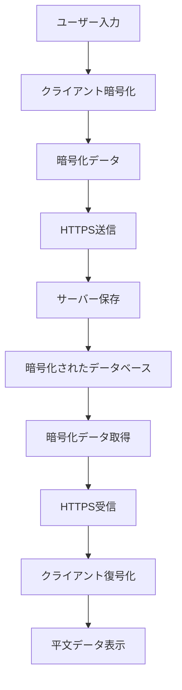

# セキュリティ

このドキュメントでは、Antアプリケーションで実装されているセキュリティ機能と対策について説明します。

## セキュリティ概要

Antは、ユーザーのプライバシーとデータ保護を最優先に設計されています。主要なセキュリティ機能：

- **エンドツーエンド暗号化**: すべてのタスクデータをクライアントサイドで暗号化
- **ゼロナレッジアーキテクチャ**: サーバーは暗号化されたデータのみを保存
- **認証・認可**: JWT トークンベースの安全な認証システム
- **HTTPS通信**: すべての通信の暗号化

## データ暗号化

### クライアントサイド暗号化

すべてのタスクデータは、サーバーに送信される前にクライアントサイドで暗号化されます。

#### 暗号化の実装

**ファイル**: `src/utils/crypto/index.ts`

```typescript
// AES-GCMアルゴリズムを使用した暗号化
export async function encryptObject<T>(obj: T, key: string): Promise<string> {
  // 1. オブジェクトをJSONシリアライズ
  const jsonString = JSON.stringify(obj);
  
  // 2. キーの派生
  const derivedKey = await deriveKey(key);
  
  // 3. AES-GCM暗号化
  const encrypted = await crypto.subtle.encrypt(
    {
      name: 'AES-GCM',
      iv: generateIV(), // ランダムなIV
    },
    derivedKey,
    new TextEncoder().encode(jsonString)
  );
  
  // 4. Base64エンコード
  return btoa(String.fromCharCode(...new Uint8Array(encrypted)));
}

// 復号化
export async function decryptObject<T>(
  encryptedData: string, 
  key: string
): Promise<T> {
  // 暗号化の逆プロセス
  // ...実装詳細
}
```

#### キー管理

```typescript
// src/services/key/index.ts

// ユーザー固有の暗号化キーの取得
export function getUserKey(): string {
  // ユーザーのパスワードまたは認証情報から派生
  // セッション中のみメモリに保持
  return derivedUserKey;
}

// キーの派生（PBKDF2）
async function deriveKey(password: string): Promise<CryptoKey> {
  const encoder = new TextEncoder();
  const keyMaterial = await crypto.subtle.importKey(
    'raw',
    encoder.encode(password),
    { name: 'PBKDF2' },
    false,
    ['deriveKey']
  );

  return await crypto.subtle.deriveKey(
    {
      name: 'PBKDF2',
      salt: getSalt(), // ユーザー固有のソルト
      iterations: 100000,
      hash: 'SHA-256',
    },
    keyMaterial,
    { name: 'AES-GCM', length: 256 },
    false,
    ['encrypt', 'decrypt']
  );
}
```

### データフロー



## 認証システム

### JWT トークンベース認証

```typescript
// src/services/token/index.ts

// アクセストークンの管理
export function getAccessToken(): string {
  return localStorage.getItem('access_token') || '';
}

export function setAccessToken(token: string): void {
  localStorage.setItem('access_token', token);
}

export function removeAccessToken(): void {
  localStorage.removeItem('access_token');
}

// トークンの有効性チェック
export function isTokenValid(token: string): boolean {
  try {
    const payload = JSON.parse(atob(token.split('.')[1]));
    return payload.exp > Date.now() / 1000;
  } catch {
    return false;
  }
}
```

### 認証フロー

1. **ユーザー登録/ログイン**
   - ユーザーがメールアドレスとパスワードを入力
   - サーバーで認証情報を検証
   - JWTトークンを生成・返却

2. **トークンの保存**
   - クライアントでトークンをローカルストレージに保存
   - セッション中の認証状態を維持

3. **API認証**
   - すべてのAPI呼び出しでBearerトークンを送信
   - サーバーでトークンの有効性を検証

4. **トークンの更新**
   - トークン有効期限切れ時の自動更新
   - リフレッシュトークンの使用

## HTTPS通信

### TLS設定

すべてのクライアント・サーバー間通信はHTTPS（TLS 1.3）で暗号化されています。

```typescript
// API呼び出しの実装例
const response = await fetch(`https://${getHost()}/auth/tasks`, {
  method: 'POST',
  headers: {
    'Content-Type': 'application/json',
    'Authorization': `Bearer ${getAccessToken()}`,
  },
  body: JSON.stringify({
    encryptedData: await encryptObject(taskData, getUserKey())
  }),
});
```

### Content Security Policy (CSP)

```json
// tauri.conf.json
{
  "app": {
    "security": {
      "csp": "default-src 'self'; script-src 'self' 'unsafe-inline'; style-src 'self' 'unsafe-inline'; connect-src 'self' https://api.example.com"
    }
  }
}
```

## データ保護

### 個人情報の取り扱い

1. **最小限の情報収集**
   - 必要最小限の個人情報のみ収集
   - タスクデータは暗号化されて保存

2. **データの保存期間**
   - ユーザーアカウント削除時にすべてのデータを削除
   - 暗号化キーも同時に削除

3. **第三者への情報提供**
   - ユーザーデータを第三者に提供しない
   - 暗号化により、運営者もデータ内容を読取不可

### ローカルストレージの保護

```typescript
// 機密データの適切な管理
class SecureStorage {
  private static readonly TOKEN_KEY = 'access_token';
  private static readonly KEY_KEY = 'user_key';

  // トークンの安全な保存
  static setToken(token: string): void {
    // 本番環境では更に安全な保存方法を検討
    localStorage.setItem(this.TOKEN_KEY, token);
  }

  // ログアウト時の完全なクリーンアップ
  static clear(): void {
    localStorage.removeItem(this.TOKEN_KEY);
    localStorage.removeItem(this.KEY_KEY);
    // その他の機密データも削除
  }
}
```

## 脆弱性対策

### XSS（Cross-Site Scripting）対策

1. **入力値のサニタイズ**

   ```typescript
   // HTMLエスケープの実装
   function escapeHtml(text: string): string {
     const div = document.createElement('div');
     div.textContent = text;
     return div.innerHTML;
   }
   ```

2. **CSP（Content Security Policy）**
   - インラインスクリプトの制限
   - 外部リソースの読み込み制限

3. **React の安全な実装**

   ```tsx
   // 安全なテキスト表示
   <div>{task.title}</div> // 自動的にエスケープされる
   
   // 危険な HTML の回避
   // <div dangerouslySetInnerHTML={{__html: userInput}} /> // 使用禁止
   ```

### CSRF（Cross-Site Request Forgery）対策

1. **SameSite Cookie**

   ```typescript
   // Cookieのセキュリティ設定
   document.cookie = "token=value; SameSite=Strict; Secure; HttpOnly";
   ```

2. **Origin検証**

   ```typescript
   // APIリクエストでのOrigin確認
   if (request.headers.origin !== 'https://yourdomain.com') {
     throw new Error('Invalid origin');
   }
   ```

### インジェクション攻撃対策

1. **パラメータバインディング**
   - SQLインジェクション対策
   - NoSQLインジェクション対策

2. **入力値検証**

   ```typescript
   // Zodスキーマによる検証
   const taskSchema = z.object({
     title: z.string().min(1).max(255),
     description: z.string().max(1000).optional(),
     priority: z.enum(['low', 'medium', 'high']).optional(),
   });
   ```

## 監査とロギング

### セキュリティイベントの記録

```typescript
// セキュリティイベントのログ記録
class SecurityLogger {
  static logAuthAttempt(email: string, success: boolean): void {
    console.log(`Auth attempt: ${email}, Success: ${success}`);
    // 本番環境では専用のログシステムに送信
  }

  static logSuspiciousActivity(activity: string): void {
    console.warn(`Suspicious activity detected: ${activity}`);
    // セキュリティチームに通知
  }
}
```

### 定期的なセキュリティ監査

1. **依存関係の脆弱性チェック**

   ```bash
   npm audit
   npm audit fix
   ```

2. **コードセキュリティ分析**

   ```bash
   # Snyk によるセキュリティスキャン
   npx snyk test
   ```

3. **ペネトレーションテスト**
   - 定期的な外部セキュリティ監査
   - 脆弱性の発見と修正

## セキュリティ設定のチェックリスト

### 開発環境

- [ ] HTTPSの使用
- [ ] CSPの適切な設定
- [ ] 依存関係の定期的な更新
- [ ] セキュリティテストの実装

### 本番環境

- [ ] TLS 1.3の使用
- [ ] セキュリティヘッダーの設定
- [ ] ログ監視システムの構築
- [ ] バックアップとリカバリ計画

### コード

- [ ] 入力値検証の実装
- [ ] エラーハンドリングの適切な実装
- [ ] 機密情報のハードコーディング禁止
- [ ] セキュリティテストのカバレッジ確保

## インシデント対応

### セキュリティインシデントの対応手順

1. **検出と初期対応**
   - インシデントの検出
   - 影響範囲の特定
   - 初期封じ込め

2. **詳細調査**
   - ログ分析
   - 影響を受けたデータの特定
   - 攻撃手法の分析

3. **復旧**
   - 脆弱性の修正
   - システムの復旧
   - セキュリティ強化

4. **事後対応**
   - インシデントレポートの作成
   - 再発防止策の実装
   - ユーザーへの適切な通知

## セキュリティ教育

### 開発者向けガイドライン

1. **セキュアコーディング**
   - OWASP Top 10の理解
   - セキュリティベストプラクティスの実践

2. **定期的な教育**
   - セキュリティ勉強会の実施
   - 最新の脅威情報の共有

## 今後のセキュリティ強化予定

- [ ] 多要素認証（MFA）の実装
- [ ] ゼロトラストアーキテクチャの採用
- [ ] エンドポイント検出・応答（EDR）の導入
- [ ] セキュリティ情報・イベント管理（SIEM）の構築

このセキュリティドキュメントは、Antアプリケーションの包括的なセキュリティ対策を示しており、ユーザーのデータとプライバシーを最高レベルで保護することを目的としています。
